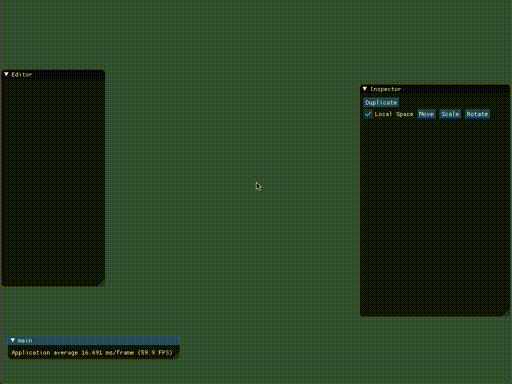

Inspired by the excellent GDC talk by the Overwatch team on their Entity Component System game engine ([link](https://youtu.be/W3aieHjyNvw)), 
reading some of the source code of Chucklefish's ECS engine that they used for WarGroove ([link](https://github.com/amzeratul/halley) and [link](https://wargroove.com/)),
and watching some of Jonathan Blow's livestreams where he works on his own game engine ([link](https://www.youtube.com/playlist?list=PLmV5I2fxaiCI9IAdFmGChKbIbenqRMi6Z)), I decided that writing my own ECS game engine would be a great big project for me to take on in the summer of 2020. 

My goals for the project are pretty simple:
- Practice developing a large codebase while keeping complexity and coupling to a minimum
- Practice writing code that is friendly to the cache and to multithreading
- Practice making and reevaluating design decisions as the project progresses. 

Big milestones already reached:
- The Entity Component System architecture itself
- autogeneration (via python scripts and #include directives) of components and their memory lifecycles
- a "Family" or component tuple system for iterating over components
- Serialization and deserialization of all entity data
- A somewhat useful editor

Big Milestones to come:
- Mesh importing
- True multithreading (the groundwork is there but its early days)
- More advanced rendering
- A few working games for testing (pong probably, maybe tetris?)

Stretch goals:
- Animation system
- In-Engine CPU profiler
- extracting the engine into a dylib 

## Build instructions (macOS)
- install these dependencies, probably using brew: `cmake`, `sdl2`, `glew`, `boost` (or alternatively, just boost filesystem). 
- clone this repo and `cd` into it. 
- exectue these commands, one after another
```
cd build
cmake .
make
``` 
